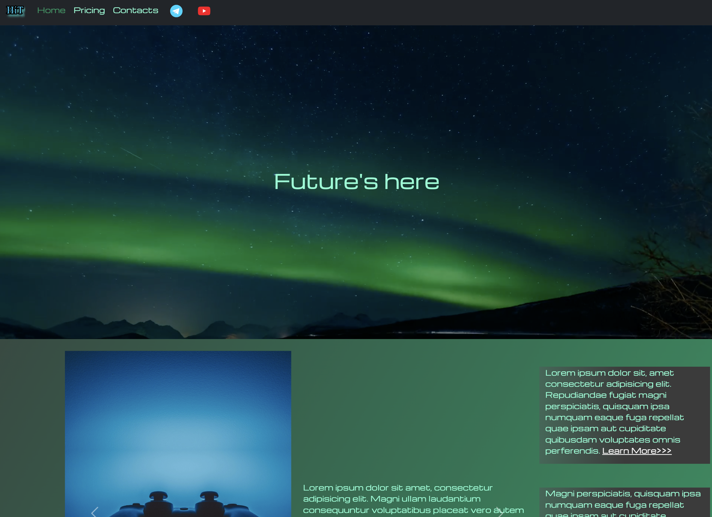
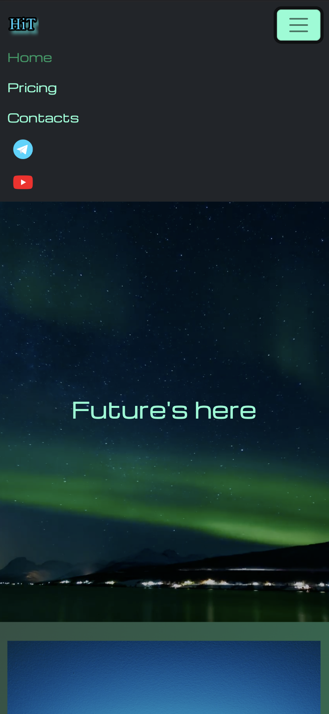
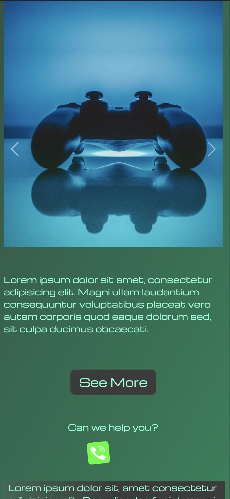
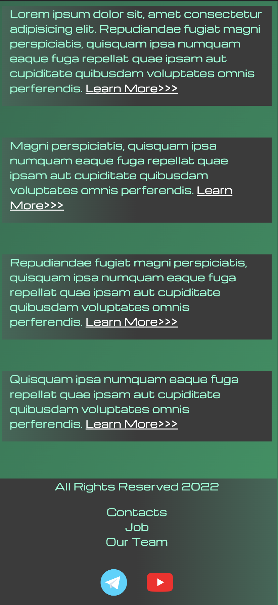

# HTML_CSS

### Сайт с адаптивной версткой, с наличием двух HTML-страниц с CSS свойствами. 

На сайте были реализованы такие элементы:
- навигационная панель, 
- карусель,
- набор карточек с продуктами,
- боковая панель,
- кнопка бургер,
- фоновое видео,
- анимация,
- подвал,
- многое другое… 

#### *screenshot_page1_width1440px(1)*

#### *screenshot_page1_width1440px(2)*

#### *screenshot_page1_width425px(1)*

#### *screenshot_page1_width425px(2)*

#### *screenshot_page1_width425px(3)*
